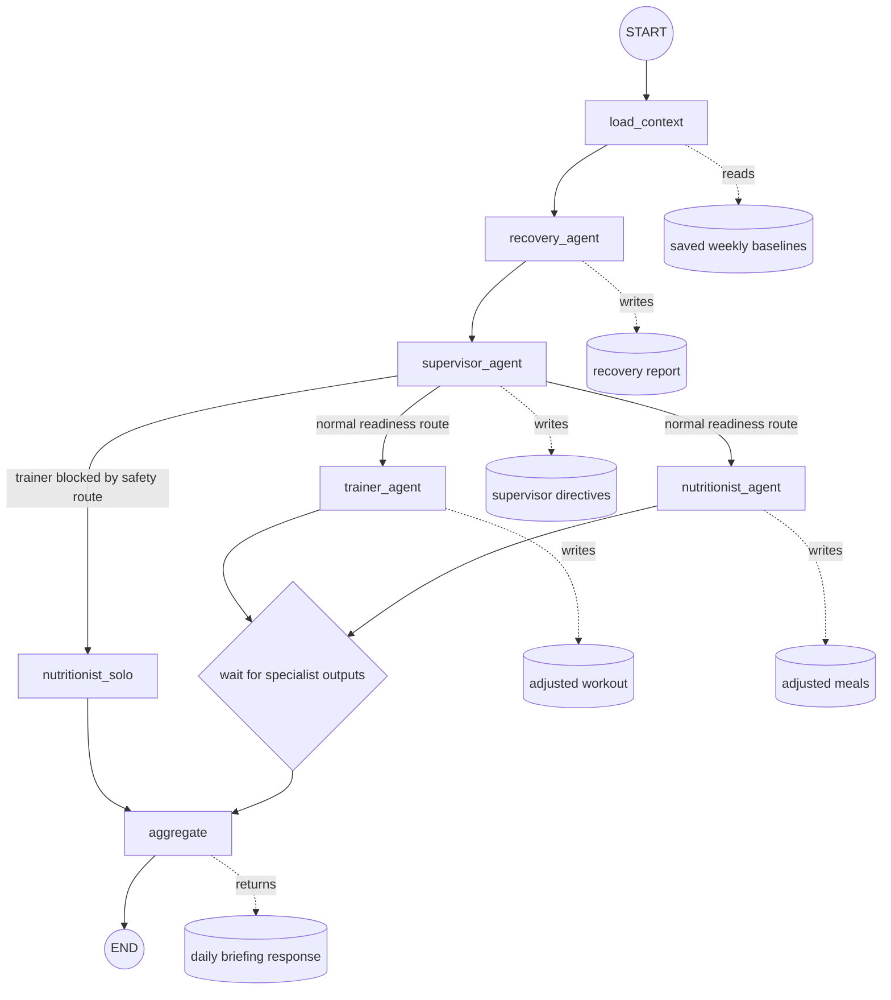

# Agentic Fitness Supervisor

Agentic Fitness Supervisor is an AI fitness coaching board where specialist agents work like a small coaching team. The app combines a user profile, generated weekly plans, mock smartwatch data, self-reported soreness/pain, RAG knowledge, and LLM plan generation to produce adaptive daily coaching decisions.

The MVP is local-first and recruiter-friendly: it shows multi-agent orchestration, FastAPI APIs, PostgreSQL/pgvector persistence, RAG ingestion, structured LLM outputs, and a polished Next.js dashboard without relying on paid infrastructure.

## Product Overview

The user keeps a demo profile with age, gender, fitness level, goal, dietary restrictions, available equipment, and injury history. They first generate:

- a weekly workout baseline;
- a weekly nutrition baseline.

After those plans exist, the user can run a morning check-in. The backend samples a cleaned row from the mock smartwatch CSV, merges it with self-reported soreness/pain/available time, runs the LangGraph workflow, and returns a daily evaluation with baseline plan, recovery status, adjusted workout, adjusted meals, and coach guardrails.

Generated weekly plans are saved per user and overwritten when regenerated. Daily check-in adjustments can also be explicitly saved without changing the weekly baseline.

## Tech Stack

| Layer | Tools |
| --- | --- |
| Frontend | Next.js, React, TypeScript, Tailwind CSS, lucide-react |
| Backend | FastAPI, Pydantic, SQLAlchemy, Alembic |
| Agent workflow | LangGraph |
| LLM provider | Gemini API with deterministic fallbacks |
| RAG | PostgreSQL, pgvector, sentence-transformers |
| Database | PostgreSQL with `pgvector/pgvector:pg16` in Docker |
| Local deployment | Docker Compose or separate Next.js/FastAPI dev servers |
| Cloud demo option | Azure Static Web Apps + Azure Container Apps + Neon/Supabase Postgres |

## Repository Layout

```text
apps/
  api/      FastAPI backend, LangGraph workflow, agents, migrations, ingestion scripts
  web/      Next.js dashboard
data/
  raw/      Local source datasets for exercises, nutrition, recovery, and wearables
```

The project intentionally keeps product documentation in this root README instead of separate docs files.

## LangGraph Flow



Routing behavior:

- The normal path runs Trainer and Nutritionist in parallel and waits for both before aggregation.
- If pain or safety rules block training, the graph skips Trainer and routes only to Nutritionist.
- The Supervisor is baseline-aware: it compares today's saved plan with recovery signals before issuing directives.
- Recovery status and hard safety constraints are deterministic Python logic. The LLM composes plans but does not own safety thresholds.

## Agents

| Agent | Responsibility |
| --- | --- |
| Recovery Agent | Scores readiness from smartwatch + self-report data, applies deterministic safety rules, retrieves recovery protocols. |
| Supervisor Agent | Coordinates the day, detects conflicts between baseline plan and recovery status, routes specialists. |
| Trainer Agent | Generates weekly workout plans and daily adjusted workouts using profile, equipment, injury history, directives, and exercise RAG. |
| Nutritionist Agent | Generates weekly nutrition plans and daily meal adjustments using profile, goals, dietary restrictions, directives, and recipe RAG. |

## Data And RAG

RAG data is stored in two Postgres tables:

- `knowledge_documents`: one row per source document/entity;
- `knowledge_chunks`: searchable text chunks with metadata and optional `embedding vector(384)`.

Collections:

| Collection | Used By | Source |
| --- | --- | --- |
| `exercise_knowledge_base` | Trainer Agent | Exercise dataset JSON |
| `nutrition_knowledge_base` | Nutritionist Agent | Nutrition recipe CSV |
| `recovery_knowledge_base` | Recovery Agent | Curated recovery protocol JSON |

The retrieval service uses pgvector semantic search when embeddings exist. If embeddings are missing or local embedding dependencies are unavailable, it falls back to lexical scoring over `knowledge_chunks`.

The default embedding model is:

```text
intfloat/multilingual-e5-small
```

It creates 384-dimensional embeddings for `knowledge_chunks.embedding`.

## Wearable Simulation

The wearable CSV is not RAG knowledge. It simulates a smartwatch integration for the demo.

Expected file:

```text
data/raw/wearables/unclean_smartwatch_health_data.csv
```

Every `POST /api/check-ins/simulate` samples a cleaned row from this CSV. The app treats that as if the frontend had received current smartwatch data from the user's device.

CSV mapping:

| Dataset column | App field |
| --- | --- |
| `Heart Rate (BPM)` | `resting_heart_rate` |
| `Blood Oxygen Level (%)` | `blood_oxygen_level` |
| `Step Count` | `step_count` |
| `Sleep Duration (hours)` | `sleep_hours` |
| `Activity Level` | `activity_level` |
| `Stress Level` | `stress_level` |

The check-in UI sends self-reported values:

- `soreness_quads`;
- `soreness_upper`;
- `pain_level`;
- `available_minutes`.

The MVP derives:

- `sleep_score`;
- `energy_level`.

## Database

Main tables:

- `users`
- `user_profiles`
- `daily_checkins`
- `agent_runs`
- `supervisor_decisions`
- `plan_versions`
- `saved_generated_plans`
- `saved_daily_adjustments`
- `knowledge_documents`
- `knowledge_chunks`

The MVP uses a single demo user until authentication is added:

```text
demo-user
```

Profile endpoints:

```text
GET /api/profile/demo-user
PUT /api/profile/demo-user
```

Saved plan endpoints:

```text
GET /api/profile/{user_id}/generated-plans
DELETE /api/profile/{user_id}/generated-plans/{plan_id}
GET /api/profile/{user_id}/daily-adjustments
POST /api/profile/{user_id}/daily-adjustments
DELETE /api/profile/{user_id}/daily-adjustments/{adjustment_id}
```

Agent run inspection:

```text
GET /api/agent-runs
GET /api/knowledge-chunks
GET /api/knowledge-chunks?collection=exercise_knowledge_base
```

## Local Development

Install frontend dependencies:

```powershell
cd C:\FITNESS_AGENT\agentic-fitness-supervisor\apps\web
npm install
```

Install backend dependencies:

```powershell
cd C:\FITNESS_AGENT\agentic-fitness-supervisor\apps\api
python -m venv .venv
.\.venv\Scripts\Activate.ps1
pip install -e ".[rag]"
```

Start Postgres:

```powershell
cd C:\FITNESS_AGENT\agentic-fitness-supervisor
docker compose up -d postgres
```

Local database connection:

```text
Host: localhost
Port: 5432
Database: fitness_agents
Username: fitness
Password: fitness
Compose service: postgres
```

Apply migrations:

```powershell
cd C:\FITNESS_AGENT\agentic-fitness-supervisor\apps\api
$env:PERSISTENCE_ENABLED="true"
python -m alembic upgrade head
```

Start the API:

```powershell
cd C:\FITNESS_AGENT\agentic-fitness-supervisor\apps\api
$env:PERSISTENCE_ENABLED="true"
uvicorn app.main:app --reload
```

Start the web app:

```powershell
cd C:\FITNESS_AGENT\agentic-fitness-supervisor\apps\web
npm run dev
```

Local URLs:

- Web: `http://localhost:3000`
- API: `http://localhost:8000`
- API docs: `http://localhost:8000/docs`
- Health check: `http://localhost:8000/health`

Quick API-only mode without database persistence:

```powershell
$env:PERSISTENCE_ENABLED="false"
uvicorn app.main:app --reload
```

## Gemini LLM Provider

Create `apps/api/.env` from `.env.example` and add:

```text
LLM_PROVIDER=gemini
GEMINI_API_KEY=your_google_ai_studio_key
GEMINI_MODEL=gemini-3.5-flash-lite
LLM_TIMEOUT_SECONDS=30
```

Gemini is used for:

- weekly Trainer plans;
- daily Trainer adjustments inside the LangGraph check-in;
- weekly Nutritionist plans;
- daily Nutritionist adjustments.

If Gemini is disabled, rate-limited, times out, or returns invalid JSON, the backend returns deterministic fallback plans.

## Dataset Ingestion

Run these commands from `apps/api` while Postgres is running and migrations are applied.

Exercise dataset:

```powershell
$env:PERSISTENCE_ENABLED="true"
python -m app.scripts.ingest_exercises_dataset --replace
python -m app.scripts.embed_knowledge_chunks --collection exercise_knowledge_base
```

Expected local files:

```text
data/raw/exercises/exercises.json
data/raw/exercises/exercises.schema.json
```

The exercise ingestion creates searchable content from exercise name, category, body part, equipment, target muscles, secondary muscles, and English instructions. It stores metadata such as dataset id, equipment, target, secondary muscles, and media references. It does not download or store exercise image/video files.

Nutrition dataset:

```powershell
$env:PERSISTENCE_ENABLED="true"
python -m app.scripts.ingest_nutrition_dataset --replace
python -m app.scripts.embed_knowledge_chunks --collection nutrition_knowledge_base
```

Expected local file:

```text
data/raw/nutrition/healthy_eating_dataset.csv
```

Expected columns include:

- `meal_id`
- `meal_name`
- `cuisine`
- `meal_type`
- `diet_type`
- `calories`
- `protein_g`
- `carbs_g`
- `fat_g`
- `fiber_g`
- `sugar_g`
- `sodium_mg`
- `cholesterol_mg`
- `serving_size_g`
- `cooking_method`
- `prep_time_min`
- `cook_time_min`
- `rating`
- `is_healthy`
- `image_url`

By default, ingestion keeps only rows where `is_healthy` is true. Use `--include-unhealthy` only for experiments.

Recovery knowledge:

```powershell
$env:PERSISTENCE_ENABLED="true"
python -m app.scripts.ingest_recovery_protocols --replace
python -m app.scripts.embed_knowledge_chunks --collection recovery_knowledge_base
```

Expected local file:

```text
data/raw/recovery/recovery_protocols.json
```

Recovery protocols are intentionally small and curated. They cover low sleep, high soreness, elevated resting heart rate, high stress, low blood oxygen, high pain safety stop rules, high step count load reduction, and green readiness progression.

Use `--limit` for quick smoke tests:

```powershell
python -m app.scripts.ingest_exercises_dataset --replace --limit 10
python -m app.scripts.embed_knowledge_chunks --collection exercise_knowledge_base --limit 10
```

Use `--replace` with the embedding script when rebuilding vectors:

```powershell
python -m app.scripts.embed_knowledge_chunks --collection exercise_knowledge_base --replace
```

## Deployment

### Local OSS Deployment

The fully open-source local path is:

```powershell
docker compose up --build
```

This runs:

- PostgreSQL with pgvector;
- FastAPI backend;
- Next.js frontend.

For local LLM experimentation, install Ollama separately:

```bash
ollama pull qwen2.5:7b
ollama serve
```

The current hosted demo path uses Gemini instead because it is simpler to deploy publicly than running local inference in Azure.

### Azure-Friendly Demo Deployment

Recommended free-friendly shape:

- `apps/web`: Azure Static Web Apps;
- `apps/api`: Azure Container Apps on the Consumption plan;
- database: Neon or Supabase free PostgreSQL with pgvector;
- LLM: Gemini API free tier or another hosted provider.

Do not rely on free Azure compute for Ollama. Keep Ollama local for development, and use a hosted API key for the public demo.

## Licences And Data Use

This project combines application code, local datasets, and generated embeddings. Keep these concerns separate.

### Project Code

The application code licence should be defined by the repository owner before public release. If you publish the repo, add a root `LICENSE` file for your own code.

### Exercise Dataset

Source:

```text
https://github.com/hasaneyldrm/exercises-dataset/tree/main/data
```

The repository states that code, tooling, dataset structure, instruction text, and translations are MIT licensed.

Important media exception:

- exercise media under `images/` and `videos/` is not covered by MIT;
- media is attributed to Gym visual;
- cloning the dataset does not grant reuse rights for that media;
- this project should ingest only the JSON exercise data and avoid redistributing exercise media unless separate rights are obtained.

### Nutrition Dataset

Source:

```text
https://www.kaggle.com/datasets/khushikyad001/healthy-eating-dataset
```

The Kaggle page lists the licence as `MIT`. The dataset is synthetic, so use it as demo/recommendation grounding rather than clinical nutrition truth. The ingestion script stores meal names, meal type, cuisine, diet type, nutrition values, cooking method, prep/cook time, health flag, and source metadata in `nutrition_knowledge_base`.

### Wearable Dataset

The smartwatch simulation dataset is stored under:

```text
data/raw/wearables/
```

The included dataset licence is Apache License 2.0. Keep `data/raw/wearables/LICENSE` with the dataset when distributing or modifying it. If the original source provides a separate `NOTICE` file, add it next to the dataset.

### Recovery Knowledge

Recovery protocols are curated educational demo content stored in:

```text
data/raw/recovery/recovery_protocols.json
```

They are not medical diagnosis or treatment guidance. The app keeps deterministic safety checks around LLM output and should continue to do so.

## Current MVP Status

Implemented:

- polished Next.js coaching board UI;
- editable demo profile;
- weekly workout generation;
- weekly nutrition generation;
- generated plan persistence;
- morning check-in with mock smartwatch data and self-report;
- LangGraph multi-agent workflow;
- baseline-aware Supervisor directives;
- daily adjusted workout and nutrition output;
- saved daily adjustments;
- Postgres persistence and Alembic migrations;
- RAG ingestion for exercise, nutrition, and recovery collections;
- pgvector semantic retrieval with lexical fallback;
- Gemini structured output with deterministic fallbacks.

Planned future improvements:

- real authentication instead of fixed `demo-user`;
- user-specific timezone handling for check-in day selection;
- real smartwatch API integration;
- richer plan history and progress analytics;
- stronger automated tests around agent routing and UI flows.
