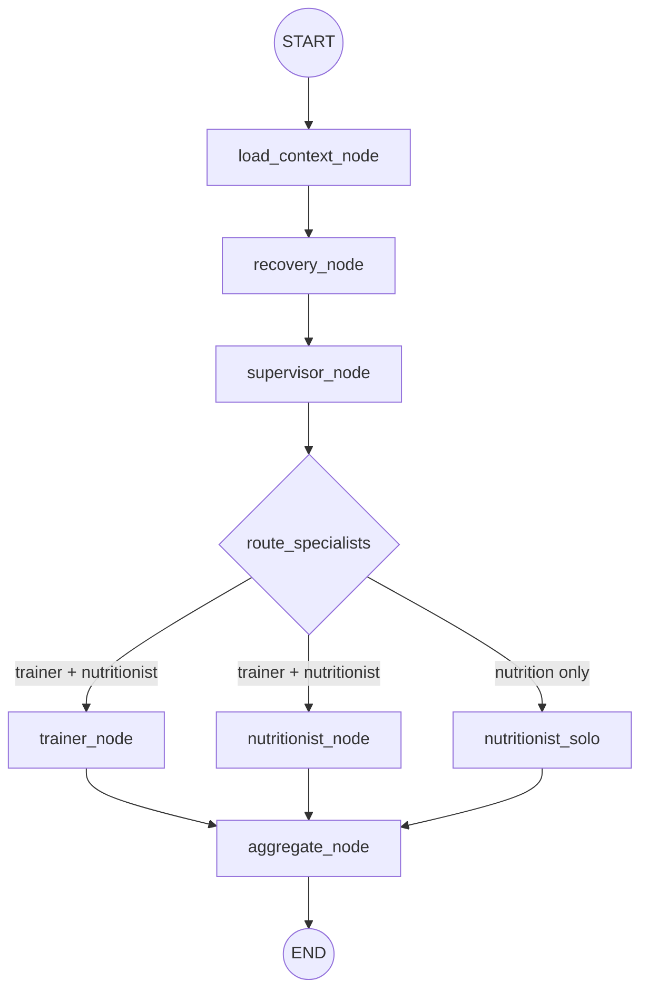

# 🏋🏻‍♀️ athletIQ: *your agentic fitness supervisor!*

**athletIQ** is a full-stack AI fitness coaching application that
generates weekly workout plans, weekly nutrition plans, and daily readiness-based
adjustments. It combines a polished Next.js interface, a FastAPI backend,
LangGraph orchestration, PostgreSQL/pgvector retrieval, structured Gemini
outputs, and deterministic fallback logic.

The project is designed as a portfolio-grade implementation of a practical
agentic system. It avoids the "single chatbot" pattern and instead coordinates a
small specialist team:

- **Trainer Agent** creates training plans and recovery-aware workout changes.
- **Nutritionist Agent** creates meal plans and recovery-aware nutrition changes.
- **Recovery Agent** evaluates sleep, soreness, stress, pain, and wearable-style
  signals.
- **Supervisor Agent** routes work between agents and prevents unsafe or
  conflicting recommendations.

##  👉 Click [here](https://ca-agentic-fitness-web.politestone-003b9a1a.germanywestcentral.azurecontainerapps.io) to test the live app!

> **⚠️ Note 1:** The live deployment runs in a restricted demo mode with pre-configured fallback responses to manage API costs. **Full functionality can be unlocked by providing a personal API key.**

> **Note 2:** The MVP uses one demo user. This keeps the portfolio demo focused on agent behavior. A production version
could add authentication while preserving the current `user_id` ownership model.

## 🎬 Demo
[](https://1drv.ms/v/c/20fe3aee5b9a4c5b/IQDoZzimQJT4RYEu5BRtJ_7GAbyqqqLoIXqcu3gHStsYsIs?e=WKTYGX)


## 📋 Key Features

- Edit a demo fitness profile with body metrics, goals, dietary restrictions,
  equipment, and injury history.
- Generate a 7-day workout plan grounded in the user's profile and exercise RAG
  context.
- Generate a 7-day nutrition plan with meal slots, macro targets, and dietary
  restriction handling.
- Run a morning check-in that combines wearable-style signals and self-reported
  readiness.
- Receive `GREEN`, `YELLOW`, or `RED` recovery status with clear constraints.
- Compare baseline weekly plans with daily adjusted recommendations.
- Save, view, download, replace, and delete generated plans.
- Save, update, and delete daily adjustments.
- Use deterministic fallback planning whenever the LLM is unavailable, disabled,
  rate-limited, or returns invalid structured output.

## 🛠️ Tech Stack

| Layer | Technology |
| --- | --- |
| Frontend | Next.js 15, React 19, TypeScript, Tailwind CSS, lucide-react, Recharts |
| Backend | FastAPI, Pydantic, SQLAlchemy, Alembic |
| Agent orchestration | LangGraph |
| LLM provider | Gemini API |
| LLM protection | Visitor-provided Gemini key with deterministic fallback |
| RAG storage | PostgreSQL + pgvector |
| Embeddings | sentence-transformers, `intfloat/multilingual-e5-small` |
| Local infrastructure | Docker Compose |
| Cloud deployment | Azure Container Apps Consumption |
| Cloud database | Aiven PostgreSQL Free |


## 🔀 Agent Workflow

Weekly workout and nutrition plans are generated through direct API endpoints.
The daily check-in uses LangGraph because it requires shared state, conditional
routing, and coordination between multiple agents.



## 🔎 RAG Design

Knowledge is stored in PostgreSQL using two tables:

| Table | Purpose |
| --- | --- |
| `knowledge_documents` | One row per source document or dataset group. |
| `knowledge_chunks` | Searchable chunks, metadata, and optional pgvector embedding. |

Collections:

| Collection | Used by | Source |
| --- | --- | --- |
| `exercise_knowledge_base` | Trainer Agent | Exercise JSON dataset |
| `nutrition_knowledge_base` | Nutritionist Agent | Healthy meal CSV |
| `recovery_knowledge_base` | Recovery Agent | Curated recovery protocols |

Retrieval behavior:

- Uses pgvector similarity search when embeddings exist.
- Falls back to lexical keyword scoring when embeddings are missing or embedding
  dependencies are unavailable.
- Filters exercise retrieval by available equipment.
- Avoids nutrition chunks that conflict with known dietary restrictions.
- Builds recovery queries from wearable and self-report risk signals.


## ❗ Requirements

- Python 3.11+
- Node.js 20+
- Docker Desktop
- A Gemini API key for optional local or visitor-provided live generation
- PostgreSQL client tools, optional but useful
- Enough disk space for the local Hugging Face model cache when generating
  embeddings

## 🛠️ Local Development

Use this path when you want to run and modify the app on your machine.

1. Clone the repository and enter the project:

```powershell
git clone https://github.com/georgiaapn/agentic-fitness-supervisor.git
cd agentic-fitness-supervisor
```

2. Create local env files:

```powershell
Copy-Item apps\api\.env.example apps\api\.env
Copy-Item apps\web\.env.example apps\web\.env.local
```

3. Install frontend dependencies:

```powershell
cd C:\FITNESS_AGENT\agentic-fitness-supervisor\apps\web
npm install
```

4. Create a clean backend virtual environment:

```powershell
cd C:\FITNESS_AGENT\agentic-fitness-supervisor\apps\api
py -3.11 -m venv .venv
.\.venv\Scripts\Activate.ps1
python -m pip install --upgrade pip
python -m pip install -e ".[rag]"
```

5. Start local PostgreSQL/pgvector:

```powershell
cd C:\FITNESS_AGENT\agentic-fitness-supervisor
docker compose up -d postgres
```

6. Run database migrations:

```powershell
cd C:\FITNESS_AGENT\agentic-fitness-supervisor\apps\api
.\.venv\Scripts\Activate.ps1
python -m alembic upgrade head
```

7. Start the API:

```powershell
cd C:\FITNESS_AGENT\agentic-fitness-supervisor\apps\api
.\.venv\Scripts\Activate.ps1
python -m uvicorn app.main:app --reload
```

8. Start the web app in a second terminal:

```powershell
cd C:\FITNESS_AGENT\agentic-fitness-supervisor\apps\web
npm run dev
```

Local URLs:

```text
Web:      http://localhost:3000
API:      http://localhost:8000
API docs: http://localhost:8000/docs
Health:   http://localhost:8000/health
```

Optional full Docker run:

```powershell
cd C:\FITNESS_AGENT\agentic-fitness-supervisor
docker compose up --build
```

#### Dataset Ingestion

Run these commands from `apps/api` after PostgreSQL is running and migrations
have been applied.

```powershell
cd C:\FITNESS_AGENT\agentic-fitness-supervisor\apps\api
$env:PERSISTENCE_ENABLED="true"
```

Ingest all RAG datasets:

```powershell
python -m app.scripts.ingest_recovery_protocols --replace
python -m app.scripts.ingest_exercises_dataset --replace
python -m app.scripts.ingest_nutrition_dataset --replace
```

Generate pgvector embeddings:

```powershell
python -m app.scripts.embed_knowledge_chunks
```

You can also embed one collection at a time:

```powershell
python -m app.scripts.embed_knowledge_chunks --collection exercise_knowledge_base
python -m app.scripts.embed_knowledge_chunks --collection nutrition_knowledge_base
python -m app.scripts.embed_knowledge_chunks --collection recovery_knowledge_base
```

#### Wearable Simulation

The product architecture assumes that the daily check-in receives current
wearable data. In this MVP, the integration is simulated from a local CSV so the
demo can run without connecting to Apple Health, Fitbit, Garmin, Whoop, or
another provider.

Expected file:

```text
data/raw/wearables/unclean_smartwatch_health_data.csv
```

Mapping:

| Dataset column | App field |
| --- | --- |
| `Heart Rate (BPM)` | `resting_heart_rate` |
| `Blood Oxygen Level (%)` | `blood_oxygen_level` |
| `Step Count` | `step_count` |
| `Sleep Duration (hours)` | `sleep_hours` |
| `Activity Level` | `activity_level` |
| `Stress Level` | `stress_level` |

The app derives `sleep_score` and `energy_level`, while the user provides
`soreness_quads`, `soreness_upper`, `pain_level`, and `available_minutes`.


## 📃 Licenses And Acknowledgements


### 🏃🏻‍♀️ Exercise Dataset

Source:

```text
https://github.com/hasaneyldrm/exercises-dataset/tree/main/data
```

The source repository states that code, tooling, dataset structure, instruction
text, and translations are MIT licensed.

Important media exception:

- exercise media under `images/` and `videos/` is not covered by MIT;
- media is attributed to Gym visual;
- this project ingests exercise JSON data and does not redistribute exercise
  image or video media.

### 🍎 Nutrition Dataset

Source:

```text
data/raw/nutrition/healthy_meal_dataset.csv
```

The nutrition dataset is a custom generated demo dataset maintained with this
project. It contains meal type, diet type, serving size, calories, and macro and
micronutrient fields.

### ⌚ Wearable Dataset

The smartwatch simulation dataset is stored under:

```text
data/raw/wearables/
```

The included dataset license is Apache License 2.0. Keep
`data/raw/wearables/LICENSE` with the dataset when distributing or modifying it.

### 🔋 Recovery Knowledge

Recovery protocols are curated educational demo content stored in:

```text
data/raw/recovery/recovery_protocols.json
```

They are not medical diagnosis or treatment guidance.
